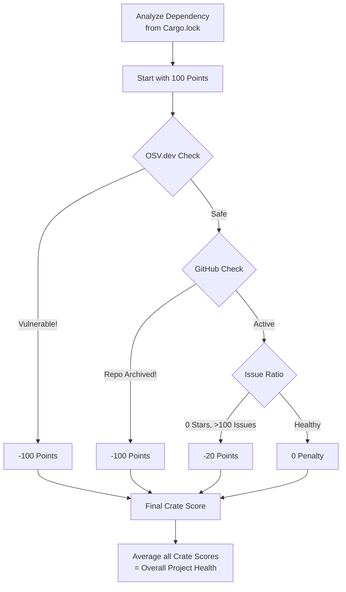

# Cargo Diagnose

`cargo-diagnose` is a high-performance Rust tool that checks the health of your project's dependencies. It analyzes your dependency tree **concurrently** using:
- **OSV.dev** (for known security problems)
- **Crates.io** (for deprecated and old versions)
- **GitHub API** (to see if the repository is maintained or archived)

## Installation

You can install it directly from crates.io using Cargo:

```bash
cargo install cargo-diagnose
```

## Usage

Go to any Rust project directory (where your `Cargo.toml` is) and run:

```bash
cargo diagnose
```

This will automatically scan your project and print a health report.

### Performance

Analysis is fully **concurrent**. Even if your project has hundreds of dependencies, `cargo-diagnose` retrieves data from OSV, Crates.io, and GitHub in parallel using `tokio`, making it significantly faster than sequential scanners.

### Authentication (GitHub Token)

To avoid GitHub API rate limits on large projects, you can provide a GitHub personal access token via the `GITHUB_TOKEN` environment variable:

```bash
export GITHUB_TOKEN=your_token_here
cargo diagnose
```

### JSON Output

If you want to use this in scripts or other tools, you can get the output as JSON:

```bash
cargo diagnose --json
```

### Fail Test (CI)

You can make `cargo-diagnose` fail the command if the score is too low. This is useful for stopping pull requests that add unsafe or unmaintained crates:

```bash
cargo diagnose --fail-under 90
```
If the overall score is less than `90%`, the command will fail.

## How the Scoring Works



Every project dependency starts with **100 points**. We scan your direct dependencies from `Cargo.toml` using exact lockfile versions. Points are deducted when serious risks are detected:

1. **Security Vulnerability (-100 points)**: Immediate fail for the crate if a vulnerability is reported on OSV.dev.
2. **Archived Repository (-100 points)**: Immediate fail if the GitHub repository has been officially archived.
3. **High Issue Ratio (-20 points)**: Minor penalty if the repository has 0 stars but an alarming number of open issues.

The overall project health score is calculated as the average of all individual crate scores.

**Formula:**
`Overall Health % = (Sum of all individual crate scores) / (Total number of crates)`

**Example:**
If your project has 10 dependencies:
- 9 crates have no issues (100 points each = 900 points)
- 1 crate has a known security vulnerability (0 points)
- **Calculation:** `(900 + 0) / 10 crates = 90% Overall Health`

If a newer version of a crate is available, it will be highlighted for your convenience, but **no points are deducted** so you don't receive unnecessary penalties for fast-moving ecosystems.

## License

MIT
